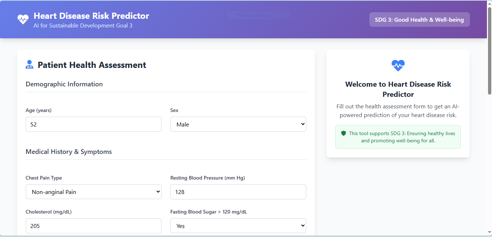

# AI for Heart Disease Risk Prediction

## 🎯 Project Overview
This project addresses **SDG 3: Good Health and Well-being** by developing a machine learning model to predict cardiovascular disease risk. Early detection enables preventive healthcare interventions, reducing premature mortality from non-communicable diseases.

## 🚀 Live Demo



- **Frontend Application**: []
- **Backend API**: []
- **API Documentation**: `/health`, `/features`, `/predict`

## 📊 Presentation

### 🎤 Elevation Pitch Deck
**Canva Presentation Link**: [https://www.canva.com/design/DAG1e_bFlLs?ui=eyJLIjp7IkEiOiJhMDQzZThhMy01YWQ4LTQ1ZGQtYjMwYS1kZTFkY2M3MWFmMGQifX0]

### Frontend
- **HTML5** - Semantic markup
- **Tailwind CSS v4** - Modern utility-first CSS framework
- **JavaScript ES6+** - Interactive functionality
- **Font Awesome** - Icons

### Backend
- **Python 3.9+** - Core programming language
- **Flask** - Web framework and API
- **Scikit-learn** - Machine learning library
- **Pandas & NumPy** - Data processing
- **Random Forest** - Classification algorithm

## 🏥 Problem Statement
Cardiovascular diseases are the leading cause of death globally. This solution provides:
- Early risk detection using patient health metrics
- Personalized prevention recommendations
- Accessible cardiac health assessment

## 🤖 Machine Learning Approach
- **Algorithm**: Supervised Learning (Random Forest)
- **Features**: 13 clinical parameters including age, cholesterol, blood pressure
- **Evaluation**: AUC-ROC, accuracy, precision-recall

## 📊 Results
- Best Model AUC: 0.89+
- Cross-validation accuracy: 80%+
- Key predictors: Chest pain type, number of major vessels, ST depression

## 🛠️ Installation & Usage
```bash
pip install -r requirements.txt
python heart_disease_predictor.py